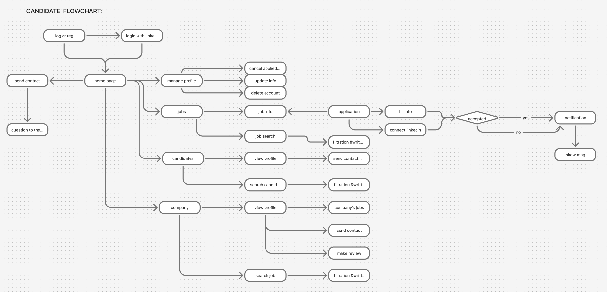
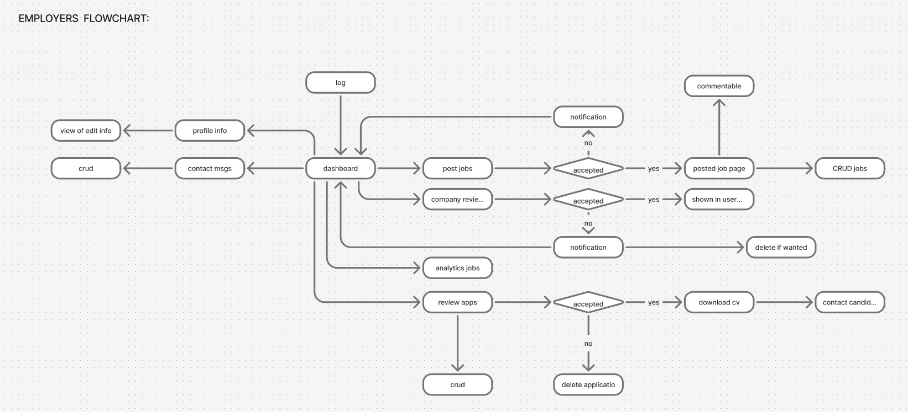
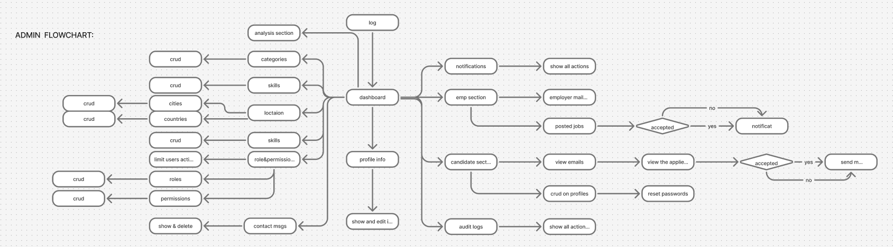

# 🚀 JobHub - Modern Job Board Platform

<div align="center">


**A comprehensive, full-stack job board platform connecting employers with talented candidates**

[Features](#-features) • [Tech Stack](#-technology-stack) • [Architecture](#-architecture) • [Installation](#-installation) • [API Documentation](#-api-documentation)

</div>

---

## 📋 Table of Contents

- [Overview](#-overview)
- [Features](#-features)
- [Technology Stack](#-technology-stack)
- [Architecture](#-architecture)
- [Workflows & Process Flows](#-workflows--process-flows)
- [Project Structure](#-project-structure)
- [Installation](#-installation)
- [Configuration](#-configuration)
- [API Documentation](#-api-documentation)
- [Database Schema](#-database-schema)
- [Security](#-security)
- [Testing](#-testing)
- [Deployment](#-deployment)
- [Contributing](#-contributing)
- [Team](#-team)
- [License](#-license)

---

## 🎯 Overview

**JobHub** is a modern, feature-rich job board platform designed to streamline the recruitment process. Built with cutting-edge technologies, it provides a seamless experience for employers to post jobs, candidates to discover opportunities, and administrators to manage the platform efficiently.

### Key Highlights

- ✨ **Modern Tech Stack**: Built with Laravel 12 and Angular 20
- 🔐 **Secure Authentication**: Laravel Sanctum API authentication with role-based access control
- 🎨 **Beautiful UI/UX**: Responsive design with Tailwind CSS, PrimeNG, and Flowbite
- 🔍 **Advanced Search**: Powerful filtering and search capabilities for jobs and candidates
- 📱 **Fully Responsive**: Mobile-first design that works on all devices
- ⚡ **Real-time Features**: Live notifications using Pusher
- 🏗️ **Clean Architecture**: Domain-driven design with separation of concerns

---

## ✨ Features

### 👔 For Employers

- **Profile Management**: Complete employer profile with company information
- **Job Posting**: Create, edit, and manage job listings with:
  - Detailed job descriptions and requirements
  - Salary ranges and benefits
  - Work type selection (Remote, On-site, Hybrid)
  - Skills and qualifications
  - Application deadlines
  - Category and location tagging
- **Application Management**: Review, accept, or reject candidate applications
- **Analytics Dashboard**: Track job views, applications, and performance metrics
- **Company Reviews**: View and manage company reviews from candidates
- **Direct Communication**: Contact accepted candidates directly
- **Notifications**: Real-time notifications for job approvals/rejections
- **Comment System**: Engage with job posts through comments

### 👤 For Candidates

- **Profile Management**: Comprehensive candidate profile with:
  - Personal information and bio
  - Skills and qualifications
  - Education and experience
  - Resume upload
  - Location preferences
- **Job Discovery**: Advanced search and filtering:
  - Keyword search
  - Category filtering
  - Salary range filtering
  - Experience level filtering
  - Location-based search
  - Work type filtering
- **Application System**: 
  - Apply to jobs with resume upload
  - Track application status
  - Save favorite jobs
  - LinkedIn integration for auto-filling forms
- **Candidate Search**: Employers can search and filter candidates by skills, location, education, and experience
- **Notifications**: Real-time updates on application status
- **Dashboard**: Manage applications and profile in one place

### 👨‍💼 For Administrators

- **Job Moderation**: Approve or reject job posts submitted by employers
- **User Management**: Manage employers and candidates
- **Content Moderation**: Remove inappropriate comments and content
- **System Monitoring**: Track overall system activity and analytics
- **Email Management**: Create and manage email templates
- **Role & Permission Management**: Full control over user roles and permissions
- **Audit Logging**: Track all system changes and user activities

### 🌟 Platform Features

- **Advanced Search & Filters**: 
  - Multi-criteria filtering for jobs and candidates
  - Dynamic filter options with real-time counts
  - URL-based filter state management
- **Real-time Notifications**: 
  - Pusher integration for live notifications
  - Email notifications
  - Dashboard notification center
- **Location Management**: 
  - Country and city-based location system
  - Location-based job and candidate filtering
- **Category & Skills System**: 
  - Hierarchical category structure
  - Skill tagging for jobs and candidates
  - Skill-based matching
- **Company Reviews**: 
  - Rating and review system for companies
  - Review moderation
- **Contact System**: 
  - Contact form for inquiries
  - Message management
- **Responsive Design**: 
  - Mobile-first approach
  - Dark mode support
  - Accessible UI components

---

## 🛠️ Technology Stack

### Backend

| Technology | Version | Purpose |
|------------|---------|---------|
| **Laravel** | 12.x | PHP Framework |
| **PHP** | 8.2+ | Programming Language |
| **MySQL** | 8.0+ | Database |
| **Laravel Sanctum** | 4.2+ | API Authentication |
| **Laravel Breeze** | 2.3+ | Authentication Scaffolding |
| **Livewire** | 3.6+ | Full-stack Framework |
| **Livewire Volt** | 1.7+ | Single File Components |
| **Spatie Permission** | 6.22+ | Role & Permission Management |
| **Pusher** | 7.2+ | Real-time Notifications |
| **Laravel Socialite** | 5.23+ | OAuth Integration (LinkedIn) |
| **Laravel Pint** | 1.24+ | Code Style Fixer |
| **PHPUnit** | 11.5+ | Testing Framework |

### Frontend

| Technology | Version | Purpose |
|------------|---------|---------|
| **Angular** | 20.x | Frontend Framework |
| **TypeScript** | 5.9+ | Programming Language |
| **RxJS** | 7.8+ | Reactive Programming |
| **Tailwind CSS** | 4.1+ | Utility-first CSS Framework |
| **PrimeNG** | 20.3+ | UI Component Library |
| **Flowbite Angular** | 20.1+ | UI Components |
| **PrimeIcons** | 7.0+ | Icon Library |
| **Font Awesome** | 7.1+ | Icon Library |
| **ngx-toastr** | 19.1+ | Toast Notifications |
| **Swiper** | 12.0+ | Touch Slider |
| **ng-select** | 20.7+ | Select Component |

### Development Tools

- **Vite**: Build tool and dev server
- **PostCSS**: CSS processing
- **Git**: Version control
- **Composer**: PHP dependency management
- **npm**: Node package management

---

## 🏗️ Architecture

### Backend Architecture

The backend follows **Domain-Driven Design (DDD)** principles with a modular structure:

```
backend/
├── app/
│   ├── Domains/              # Domain-specific modules
│   │   ├── Applications/     # Job application domain
│   │   ├── Candidates/      # Candidate domain
│   │   ├── Employers/       # Employer domain
│   │   ├── Jobs/            # Job posting domain
│   │   ├── Location/        # Location management
│   │   ├── Users/           # User management
│   │   ├── CompanyReviews/  # Review system
│   │   └── Contact/         # Contact messages
│   ├── Livewire/            # Livewire components
│   ├── Events/              # Event classes
│   ├── Notifications/       # Notification classes
│   └── Http/               # HTTP layer
├── routes/
│   ├── api.php             # API routes
│   └── web.php             # Web routes
└── database/
    ├── migrations/         # Database migrations
    └── seeders/           # Database seeders
```

#### Domain Structure

Each domain follows a consistent structure:

```
Domain/
├── Actions/              # Business logic actions
├── Controllers/          # API controllers
│   └── Api/
├── Models/               # Eloquent models
├── Requests/             # Form requests
│   └── Api/
├── Resources/            # API resources
└── Services/             # Domain services (if needed)
```

### Frontend Architecture

The frontend follows **Feature-based Architecture** with Angular standalone components:

```
frontend/
├── src/
│   ├── app/
│   │   ├── core/              # Core functionality
│   │   │   ├── guards/        # Route guards
│   │   │   ├── interceptors/  # HTTP interceptors
│   │   │   └── services/      # Shared services
│   │   ├── features/          # Feature modules
│   │   │   ├── auth/          # Authentication
│   │   │   ├── jobs/          # Job listings
│   │   │   ├── candidates/    # Candidate search
│   │   │   ├── profile/       # User profiles
│   │   │   └── ...
│   │   ├── layout/            # Layout components
│   │   └── shared/            # Shared components
│   └── environments/          # Environment configs
```

### Design Patterns

- **Repository Pattern**: Data access abstraction
- **Action Pattern**: Business logic encapsulation
- **Resource Pattern**: API response transformation
- **Service Pattern**: Business logic services
- **Observer Pattern**: Event-driven architecture
- **Guard Pattern**: Route protection

---

## 🔄 Workflows & Process Flows

### 1. Candidate Workflow

<div align="center">



</div>

### 2. Employer Workflow

<div align="center">



</div>

### 3. Admin Workflow

<div align="center">



</div>

---

## 📁 Project Structure

### Backend Structure

```
backend/
├── app/
│   ├── Domains/                    # Domain modules
│   │   ├── Applications/           # Job applications
│   │   │   ├── Actions/
│   │   │   ├── Controllers/Api/
│   │   │   ├── Models/
│   │   │   ├── Requests/
│   │   │   └── Resources/
│   │   ├── Candidates/            # Candidate management
│   │   ├── Employers/             # Employer management
│   │   ├── Jobs/                  # Job postings
│   │   ├── Location/              # Location system
│   │   ├── Users/                # User management
│   │   ├── CompanyReviews/        # Review system
│   │   └── Contact/              # Contact messages
│   ├── Livewire/                  # Livewire components
│   │   ├── Admin/                # Admin components
│   │   ├── Jobs/                 # Job components
│   │   ├── Applications/         # Application components
│   │   └── ...
│   ├── Events/                    # Event classes
│   ├── Notifications/            # Notification classes
│   └── Http/                     # HTTP layer
├── config/                       # Configuration files
├── database/
│   ├── migrations/               # Database migrations
│   └── seeders/                 # Database seeders
├── routes/
│   ├── api.php                  # API routes
│   └── web.php                  # Web routes
├── resources/
│   ├── views/                   # Blade templates
│   ├── css/                     # Stylesheets
│   └── js/                      # JavaScript
└── tests/                        # Test files
```

### Frontend Structure

```
frontend/
├── src/
│   ├── app/
│   │   ├── core/                 # Core functionality
│   │   │   ├── guards/          # Route guards
│   │   │   ├── interceptors/    # HTTP interceptors
│   │   │   └── services/        # Shared services
│   │   ├── features/            # Feature modules
│   │   │   ├── auth/            # Authentication
│   │   │   ├── jobs/            # Job listings
│   │   │   ├── candidates/      # Candidate search
│   │   │   ├── profile/         # User profiles
│   │   │   ├── home/            # Home page
│   │   │   └── ...
│   │   ├── layout/              # Layout components
│   │   │   ├── header/         # Header component
│   │   │   ├── footer/         # Footer component
│   │   │   └── layout/         # Main layout
│   │   └── shared/             # Shared components
│   ├── environments/            # Environment configs
│   └── index.html              # Entry point
├── public/                      # Static assets
└── angular.json                # Angular configuration
```

---

## 🚀 Installation

### Prerequisites

- PHP 8.2 or higher
- Composer
- Node.js 18+ and npm
- MySQL 8.0+
- Git

### Backend Setup

1. **Clone the repository**
   ```bash
   git clone <repository-url>
   cd JobHub/backend
   ```

2. **Install dependencies**
   ```bash
   composer install
   npm install
   ```

3. **Environment configuration**
   ```bash
   cp .env.example .env
   php artisan key:generate
   ```

4. **Configure database in `.env`**
   ```env
   DB_CONNECTION=mysql
   DB_HOST=127.0.0.1
   DB_PORT=3306
   DB_DATABASE=JobHub
   DB_USERNAME=root
   DB_PASSWORD=
   ```

5. **Run migrations and seeders**
   ```bash
   php artisan migrate
   php artisan db:seed
   ```

6. **Create storage link**
   ```bash
   php artisan storage:link
   ```

7. **Start development server**
   ```bash
   php artisan serve
   # Or use the dev script
   composer run dev
   ```

### Frontend Setup

1. **Navigate to frontend directory**
   ```bash
   cd ../frontend
   ```

2. **Install dependencies**
   ```bash
   npm install
   ```

3. **Configure API endpoint** in `src/app/core/services/*.service.ts`
   ```typescript
   private apiUrl = 'http://localhost:8000/api';
   ```

4. **Start development server**
   ```bash
   npm start
   # Or
   ng serve
   ```

### Quick Setup Script

```bash
# Backend
cd backend
composer install && npm install
cp .env.example .env
php artisan key:generate
php artisan migrate --seed
php artisan storage:link

# Frontend
cd ../frontend
npm install
npm start
```

---

## ⚙️ Configuration

### Environment Variables

#### Backend (.env)

```env
APP_NAME="JobHub"
APP_ENV=local
APP_DEBUG=true
APP_URL=http://localhost:8000

DB_CONNECTION=mysql
DB_HOST=127.0.0.1
DB_PORT=3306
DB_DATABASE=JobHub
DB_USERNAME=root
DB_PASSWORD=

BROADCAST_DRIVER=pusher
PUSHER_APP_ID=your-app-id
PUSHER_APP_KEY=your-app-key
PUSHER_APP_SECRET=your-app-secret
PUSHER_APP_CLUSTER=mt1

SANCTUM_STATEFUL_DOMAINS=localhost:4200

LINKEDIN_CLIENT_ID=your-linkedin-client-id
LINKEDIN_CLIENT_SECRET=your-linkedin-client-secret
LINKEDIN_REDIRECT_URI=http://localhost:8000/auth/linkedin/callback
```

#### Frontend

Update API endpoints in service files:
- `src/app/core/services/auth.service.ts`
- `src/app/core/services/job.service.ts`
- `src/app/core/services/candidate-search.service.ts`
- etc.

---

## 📡 API Documentation

### Authentication Endpoints

#### Candidate Authentication

```http
POST /api/auth/candidate/register
POST /api/auth/candidate/login
POST /api/auth/candidate/logout
POST /api/auth/candidate/forgot-password
POST /api/auth/candidate/reset-password
POST /api/auth/candidate/send-verification-code
POST /api/auth/candidate/verify-code
```

### Job Endpoints

```http
GET  /api/jobs                    # List all jobs
GET  /api/jobs/{id}               # Get job details
GET  /api/jobs/filter-options     # Get filter options
POST /api/jobs/save               # Save job (authenticated)
GET  /api/jobs/saved              # Get saved jobs (authenticated)
DELETE /api/jobs/unsave/{id}      # Unsave job (authenticated)
```

### Candidate Endpoints

```http
GET  /api/candidates              # List all candidates
GET  /api/candidates/{id}         # Get candidate details
GET  /api/candidates/search       # Search candidates
GET  /api/candidates/filter-options # Get filter options
GET  /api/auth/candidate/info     # Get current candidate profile (authenticated)
POST /api/auth/candidate/info    # Update candidate profile (authenticated)
```

### Application Endpoints

```http
GET  /api/applications            # List applications (authenticated)
GET  /api/applications/{id}       # Get application details (authenticated)
POST /api/applications            # Create application (authenticated)
GET  /api/applications/stats      # Get application statistics (authenticated)
GET  /api/applications/available-jobs # Get available jobs (authenticated)
```

### Company Endpoints

```http
GET  /api/companies/search        # Search companies
GET  /api/companies/filter-options # Get filter options
GET  /api/employerinfo            # Get employer info (authenticated)
GET  /api/employerinfo/{id}        # Get employer info by ID
```

### Other Endpoints

```http
GET  /api/categories              # List categories
GET  /api/skills                  # List skills
GET  /api/locations/countries    # List countries
GET  /api/locations/cities        # List cities
POST /api/contact                 # Send contact message
GET  /api/contact                 # List contact messages (authenticated)
GET  /api/company-reviews/company/{id} # Get company reviews
POST /api/company-reviews         # Create review (authenticated)
GET  /api/home                    # Get home page data
```

### Authentication

All protected endpoints require authentication via Laravel Sanctum. Include the token in the Authorization header:

```http
Authorization: Bearer {token}
```

---

## 🗄️ Database Schema

### Core Tables

- **users**: User accounts (candidates, employers, admins)
- **candidate_infos**: Candidate profile information
- **employer_infos**: Employer/company information
- **job_posts**: Job listings
- **job_applications**: Job applications
- **categories**: Job categories
- **skills**: Skills database
- **job_skills**: Job-skill pivot table
- **candidate_skill**: Candidate-skill pivot table
- **saved_jobs**: Saved jobs by candidates
- **locationables**: Polymorphic location table
- **countries**: Countries
- **cities**: Cities
- **company_reviews**: Company reviews
- **contact_messages**: Contact form messages
- **comments**: Polymorphic comments
- **notifications**: System notifications
- **audit_logs**: Audit trail

### Key Relationships

- **User** → **CandidateInfo** (One-to-One)
- **User** → **EmployerInfo** (One-to-One)
- **EmployerInfo** → **JobPost** (One-to-Many)
- **JobPost** → **JobApplication** (One-to-Many)
- **CandidateInfo** → **JobApplication** (One-to-Many)
- **JobPost** ↔ **Skill** (Many-to-Many)
- **CandidateInfo** ↔ **Skill** (Many-to-Many)
- **JobPost** → **Locationable** (Polymorphic)
- **CandidateInfo** → **Locationable** (Polymorphic)

---

## 🔒 Security

### Authentication & Authorization

- **Laravel Sanctum**: Token-based API authentication
- **Spatie Permission**: Role-based access control (RBAC)
- **Route Guards**: Protected routes with middleware
- **CSRF Protection**: Cross-site request forgery protection
- **Password Hashing**: Bcrypt password hashing
- **Rate Limiting**: API rate limiting on sensitive endpoints

### Data Protection

- **Input Validation**: Form requests and validation rules
- **SQL Injection Prevention**: Eloquent ORM with parameter binding
- **XSS Protection**: Output escaping in Blade templates
- **CORS Configuration**: Cross-origin resource sharing setup
- **HTTPS**: SSL/TLS encryption (production)

### Best Practices

- Environment-based configuration
- Secure password reset flow
- Email verification system
- Audit logging for sensitive operations
- Soft deletes for data retention

---

## 🧪 Testing

### Backend Testing

```bash
# Run all tests
php artisan test

# Run specific test suite
php artisan test --testsuite=Feature
php artisan test --testsuite=Unit

# Run with coverage
php artisan test --coverage
```

### Frontend Testing

```bash
# Run unit tests
npm test

# Run tests in watch mode
npm run test:watch

# Run tests with coverage
npm run test:coverage
```

---

## 🚢 Deployment

### Backend Deployment

1. **Production environment setup**
   ```bash
   composer install --optimize-autoloader --no-dev
   php artisan config:cache
   php artisan route:cache
   php artisan view:cache
   php artisan migrate --force
   ```

2. **Set up web server** (Nginx/Apache)
3. **Configure SSL certificate**
4. **Set up queue workers**
5. **Configure cron jobs**

### Frontend Deployment

1. **Build for production**
   ```bash
   npm run build --configuration=production
   ```

2. **Deploy to hosting** (Vercel, Netlify, AWS S3, etc.)
3. **Configure environment variables**
4. **Set up CDN** (optional)

---

## 🤝 Contributing

Contributions are welcome! Please follow these steps:

1. Fork the repository
2. Create a feature branch (`git checkout -b feature/AmazingFeature`)
3. Commit your changes (`git commit -m 'Add some AmazingFeature'`)
4. Push to the branch (`git push origin feature/AmazingFeature`)
5. Open a Pull Request

### Code Style

- **Backend**: Follow PSR-12 coding standards (enforced by Laravel Pint)
- **Frontend**: Follow Angular style guide
- **Commits**: Use conventional commit messages

---

## 📄 License

This project is licensed under the MIT License - see the LICENSE file for details.

---

## 👥 Team

### Development Team

| Role | Name |
|------|------|
| **Team Leader** | Abdullah Shokr |
| **Developer** | Abdallah El-Saied |
| **Developer** | Alaa Amr |
| **Developer** | Mariam Ayman |
| **Developer** | Hagar Ibrahim |

---

### Meet the Team

- **Abdullah Shokr** - Team Leader & Project Coordinator
- **Abdallah El-Saied** - Full-stack Developer
- **Alaa Amr** - Full-stack Developer
- **Mariam Ayman** - Full-stack Developer
- **Hagar Ibrahim** - Full-stack Developer

---

## 🙏 Acknowledgments

- Laravel community
- Angular team
- All open-source contributors
- PrimeNG team
- Tailwind CSS team

---

## 📞 Support

For support, email support@JobHub.com or open an issue in the repository.

---

<div align="center">

**Built with ❤️ using Laravel & Angular**

⭐ Star this repo if you find it helpful!

</div>

